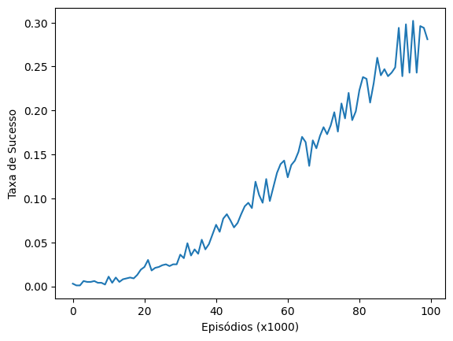
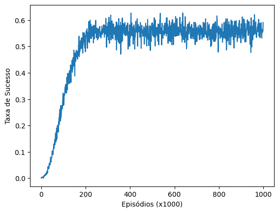
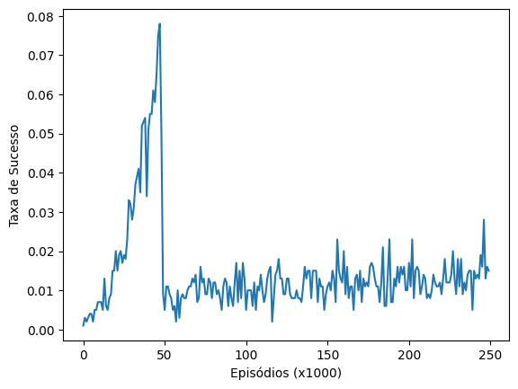
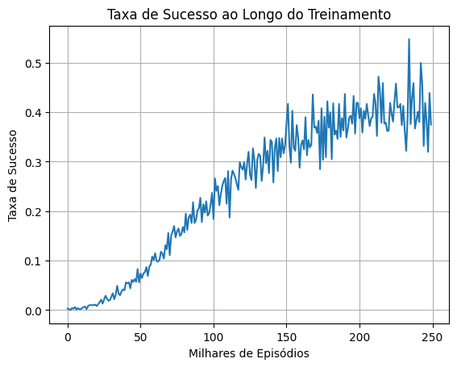
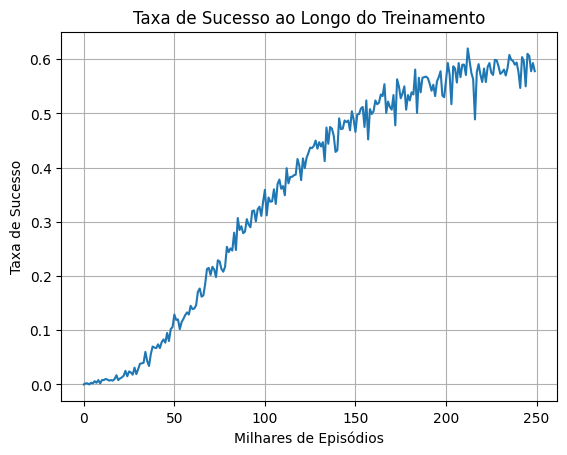
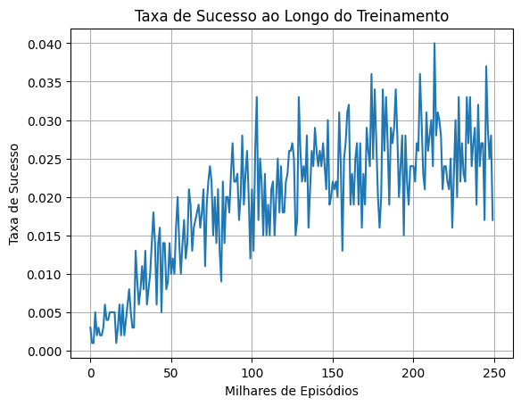
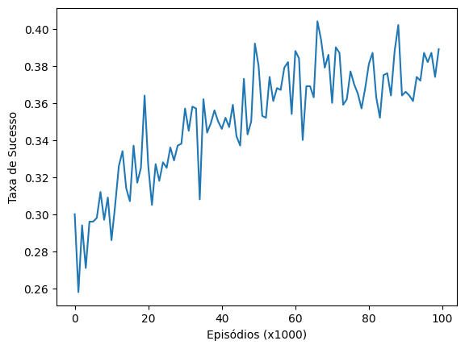
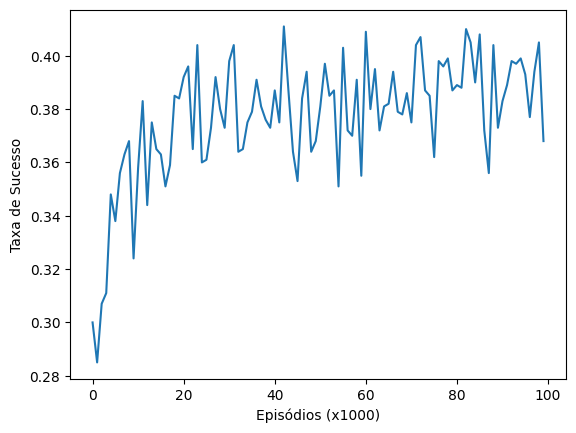
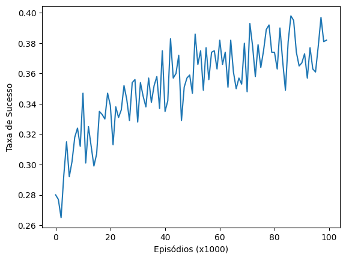
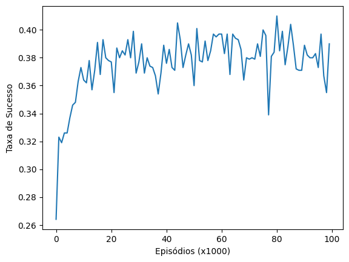

# Relatório
Este relatório apresenta um comparativo de resultados entre dois métodos de diferença temporal, o SARSA e o Q-Learning, em três diferentes ambientes do Gymnasium: Frozen Lake, BlackJack e Taxi.

Aluno: Davi Diógenes Ferreira de Almeida

Link para o repositório: https://github.com/davialmeida135/rl-qlearning

## Algoritmos

A principal diferença entre o Q-Learning e o SARSA é o modo como ambos lidam com a política aprendida.
### Q-Learning
O Q-Learning é um algoritmo **off-policy**, que aprende sobre a política ótima independentemente da política que está sendo seguida durante o treinamento. Ele utiliza a estratégia gulosa para atualizar os valores Q, sempre considerando a ação que maximiza o valor Q no próximo estado, mesmo que esta não seja a ação efetivamente tomada pela política de exploração (como epsilon-greedy).

A implementação utilizada foi:
```python
for episodio in range(total_episodios):
    estado, info = env.reset()
    finalizado = False

    for passo in range(total_passos_max):
        if random.uniform(0, 1) < epsilon:
            acao = env.action_space.sample()
        else:
            acao = np.argmax(q_table[estado, :])

        novo_estado, recompensa, terminado, truncado, info = env.step(acao)
        finalizado = terminado or truncado

        # Atualização da Q-Table
        q_table[estado, acao] = q_table[estado, acao] + taxa_aprendizado * \
            (recompensa + fator_desconto * np.max(q_table[novo_estado, :]) - q_table[estado, acao])

        estado = novo_estado

        if finalizado:
            break

    # Atualização de Epsilon (decay)
    epsilon = max(epsilon_min, np.exp(-taxa_decaimento * episodio))
```

### SARSA
Por outro lado, o SARSA é um algoritmo **on-policy**, que aprende sobre a mesma política que está sendo utilizada para selecionar as ações durante o treinamento. Isso significa que o SARSA considera a próxima ação que será efetivamente tomada pela política atual (incluindo ações de exploração), tornando-o mais conservador em ambientes com riscos.

```python
for episodio in range(total_episodios):
    estado, info = env.reset()
    finalizado = False

    # Escolha da ação inicial
    if random.uniform(0, 1) < epsilon:
        acao = env.action_space.sample()
    else:
        acao = np.argmax(q_table[estado, :])

    for passo in range(total_passos_max):

        novo_estado, recompensa, terminado, truncado, info = env.step(acao)
        finalizado = terminado or truncado

        # Escolha da próxima ação on-policy
        if finalizado:
            proxima_acao = None
            q_proximo = 0
        else:
            if random.uniform(0, 1) < epsilon:
                proxima_acao = env.action_space.sample()
            else:
                proxima_acao = np.argmax(q_table[novo_estado, :])
            q_proximo = q_table[novo_estado, proxima_acao]

        # SARSA Update: Q(S,A) = Q(S,A) + lr[R + decay*Q(S',A') - Q(S,A)]
        q_table[estado, acao] = q_table[estado, acao] + taxa_aprendizado * \
            (recompensa + fator_desconto * q_proximo - q_table[estado, acao])

        estado = novo_estado
        acao = proxima_acao

        if finalizado:
            break

    # Atualização de Epsilon
    epsilon = max(epsilon_min, np.exp(-taxa_decaimento * episodio))
```

## Ambientes de Teste

1. **Frozen Lake**: Um ambiente de navegação em grade onde o agente deve atravessar um lago congelado evitando buracos. Este ambiente permite testar os algoritmos tanto em versões determinísticas quanto estocásticas (com superfície escorregadia).

2. **BlackJack**: Um ambiente baseado no jogo de cartas blackjack, onde o agente deve decidir quando pedir mais cartas ou parar, buscando se aproximar de 21 sem ultrapassar.

3. **Taxi**: Um ambiente onde um táxi deve navegar em uma grade, pegar passageiros e levá-los aos seus destinos, testando a capacidade dos algoritmos em tarefas hierárquicas. Também permite testar versões determinísticas e estocásticas (com mudança de destino os buscar o passageiro).


## Frozen Lake
### QLearning
Inicialmente, é possível perceber que o frozen lake sem estar "escorregadio" é um problema muito simples que é rapidamente aprendido pelo algoritmo.
```
slippery=False
total_episodios = 100_000
total_passos_max = 250

taxa_aprendizado = 0.1
fator_desconto = 0.99

epsilon = 1.0
epsilon_min = 0.01
taxa_decaimento = 0.00002

📊 RESULTADO FINAL: Taxa de sucesso: 100.0% (500/500)
```

Ao tornar o gelo escorregadio, a coisa fica mais complexa e o modelo só alcança 35% de sucesso.
```
slippery=True
total_episodios = 100_000
total_passos_max = 250

taxa_aprendizado = 0.1
fator_desconto = 0.99

epsilon = 1.0
epsilon_min = 0.01
taxa_decaimento = 0.00002

📊 RESULTADO FINAL: Taxa de sucesso: 35.8% (179/500)
```


Com 1 milhão de episódios, o modelo melhorou consideravelmente, com seu aprendizado estabilizando em +- 250000 episódios.
```
slippery=True

total_episodios = 1_000_000
total_passos_max = 250

taxa_aprendizado = 0.1
fator_desconto = 0.99

epsilon = 1.0
epsilon_min = 0.01
taxa_decaimento = 0.00002
📊 RESULTADO FINAL: Taxa de sucesso: 61.2% (306/500)
```


Mantendo os 250000 episódios, testei anular o fator de desconto e os resultados foram muito ruins
```
total_episodios = 200_000
total_passos_max = 250

taxa_aprendizado = 0.1
fator_desconto = 1

epsilon = 1.0
epsilon_min = 0.01
taxa_decaimento = 0.00002
📊 RESULTADO FINAL: Taxa de sucesso: 13.8% (69/500)
```


### SARSA
Para o SARSA, iniciamos na configuração de maior sucesso para o Q-Learning.
Novamente, o ambiente estocástico foi resolvido com 100% de sucesso.
```
is_slippery=False
total_episodios = 250_000
total_passos_max = 250

taxa_aprendizado = 0.1
fator_desconto = 0.99

epsilon = 1.0
epsilon_min = 0.01
taxa_decaimento = 0.00002
📊 RESULTADO FINAL: Taxa de sucesso: 100.0% (500/500)
```

Já no ambiente estocástico, com as mesmas cofigurações do Q-Learning, os resultados foram consideravelmente piores.
```
is_slippery=True
total_episodios = 250_000
total_passos_max = 250

taxa_aprendizado = 0.1
fator_desconto = 0.99

epsilon = 1.0
epsilon_min = 0.01
taxa_decaimento = 0.00002

📊 RESULTADO FINAL: Taxa de sucesso: 22.8% (114/500)
```



Em seguida, foram feitos experimentos em cima do valor do learning rate.
Com os resultados abaixo, podemos ver que learning rates extremos não são benéficos para o SARSA e que o learning rate afeta muito a qualidade dos resultados.
O learning rate mais intermediário (0.01) alcançou um resultado até melhor que o Q-Learning

```
is_slippery=True
total_episodios = 250_000
total_passos_max = 250

taxa_aprendizado = 0.01
fator_desconto = 0.99

epsilon = 1.0
epsilon_min = 0.01
taxa_decaimento = 0.00002
📊 RESULTADO FINAL: Taxa de sucesso: 63.4% (317/500)
```



```
is_slippery=True
total_episodios = 250_000
total_passos_max = 250

taxa_aprendizado = 0.001
fator_desconto = 0.99

epsilon = 1.0
epsilon_min = 0.01
taxa_decaimento = 0.00002
📊 RESULTADO FINAL: Taxa de sucesso: 3.0% (15/500)
```


## Blackjack
### QLearning
```
total_episodios = 100_000
total_passos_max = 250

taxa_aprendizado = 0.1
fator_desconto = 0.99

epsilon = 1.0
epsilon_min = 0.1
taxa_decaimento = 0.00002

📊 RESULTADO FINAL: Taxa de sucesso: 38.69% (19343/50000)
```


Tentei fazer uma mudança mais radical, alterando todos os hiperparâmetros do treinamento, mas os resultados não foram diferentes.
Durante o treinamento, houveram alguns picos de performance mais alta (+-40%), nas ao final o resultado permaneceu o mesmo do treinamento anterior.
```
total_episodios = 100_000
total_passos_max = 250

taxa_aprendizado = 0.05
fator_desconto = 0.95

epsilon = 1.0
epsilon_min = 0.01
taxa_decaimento = 0.0001

📊 RESULTADO FINAL: Taxa de sucesso: 38.30% (19150/50000)
Vitórias: 19150((0.383))
Empates: 2471((0.04942))
Derrotas: 28379((0.56758))
```


### SARSA

```
total_episodios = 100_000
total_passos_max = 250

taxa_aprendizado = 0.1
fator_desconto = 0.99

epsilon = 1.0
epsilon_min = 0.1
taxa_decaimento = 0.00002

📊 RESULTADO FINAL: Taxa de sucesso: 38.46% (19228/50000)
Vitórias: 19228((0.38456))
Empates: 2440((0.0488))
Derrotas: 28332((0.56664))
```



Tentei fazer uma mudança mais radical, alterando todos os hiperparâmetros do treinamento, mas os resultados não foram diferentes.
```
total_episodios = 100_000
total_passos_max = 250

taxa_aprendizado = 0.05
fator_desconto = 0.95

epsilon = 1.0
epsilon_min = 0.01
taxa_decaimento = 0.0001

📊 RESULTADO FINAL: Taxa de sucesso: 38.57% (19286/50000)
Vitórias: 19286((0.38572))
Empates: 2405((0.0481))
Derrotas: 28309((0.56618))
```


É possível perceber que, no caso do blackjack, o SARSA e o QLearning se comportam de maneira similar

## Taxi

O ambiente Taxi, em geral, se mostrou de fácil resolução tanto para o SARSA quanto para o Q-Learning, uma vez que ambos apresentaram 100% de taxa de sucesso até na configuração de maior complexidade (com o passageiro podendo mudar a rota).
### Q-Learning

```
fickle_passenger=False

total_episodios = 100_000
total_passos_max = 250

taxa_aprendizado = 0.01
fator_desconto = 1

epsilon = 1.0
epsilon_min = 0.01
taxa_decaimento = 0.00002

📊 RESULTADO FINAL: Taxa de sucesso: 100.0% (500/500)
```

Com fickle passenger
```
fickle_passenger=True

total_episodios = 100_000
total_passos_max = 250

taxa_aprendizado = 0.01
fator_desconto = 1

epsilon = 1.0
epsilon_min = 0.01
taxa_decaimento = 0.00002
📊 RESULTADO FINAL: Taxa de sucesso: 100.0% (500/500)
```
### SARSA
```
fickle_passenger=False

total_episodios = 200_000
total_passos_max = 250

taxa_aprendizado = 0.01
fator_desconto = 1

epsilon = 1.0
epsilon_min = 0.01
taxa_decaimento = 0.00002

📊 RESULTADO FINAL: Taxa de sucesso: 100.0% (500/500)
```
Com ficke passenger
```
fickle_passenger=True
total_episodios = 200_000
total_passos_max = 250

taxa_aprendizado = 0.01
fator_desconto = 1

epsilon = 1.0
epsilon_min = 0.01
taxa_decaimento = 0.00002
📊 RESULTADO FINAL: Taxa de sucesso: 100.0% (500/500)
```